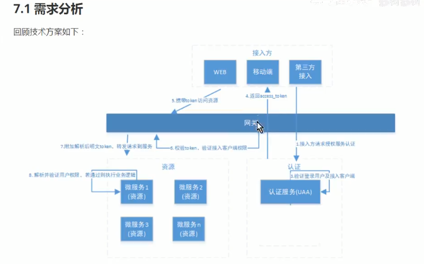
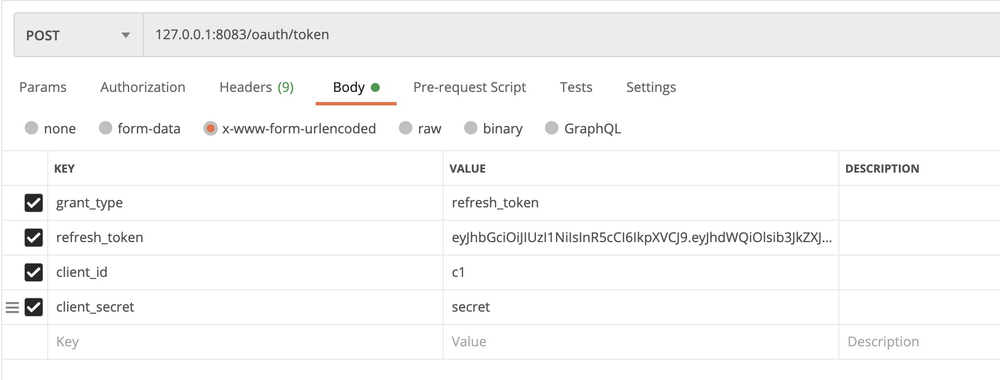

### 项目介绍
###### 1，这个项目是看了B站，av73730658，自己借鉴写的代码 
###### 2，单机版 授权例子：https://github.com/gengxiz/spring-security.git 

### 流程图

###### 1，设计方案
  

###### 2，快速开始
将 document/sql 里的脚本导入数据库，然后运行项目即可 

###### 3，获取code，在浏览器输入
127.0.0.1:8083/oauth/authorize?client_id=c1&response_type=code&scpoe=all&redirect_uri=http://www.baidu.com

###### 4，根据code，获取token
* get请求
* url ： 127.0.0.1:8083/oauth/token?client_id=c1&client_secret=secret&grant_type=authorization_code&code=v07CoE&redirect_uri=https://baidu.com

###### 5，访问受保护的order资源

* 注意：这里要通过网关访问，这样才能通过OauthFilter ，从而拼接用户信息
* 这里使用 bearer token
127.0.0.1:8081/order/

###### 6，通过网关获取token资源
只需要将上面的端口改成8081即可

###### 7，刷新token
* post 请求
* url： 127.0.0.1:8083/oauth/token

  
